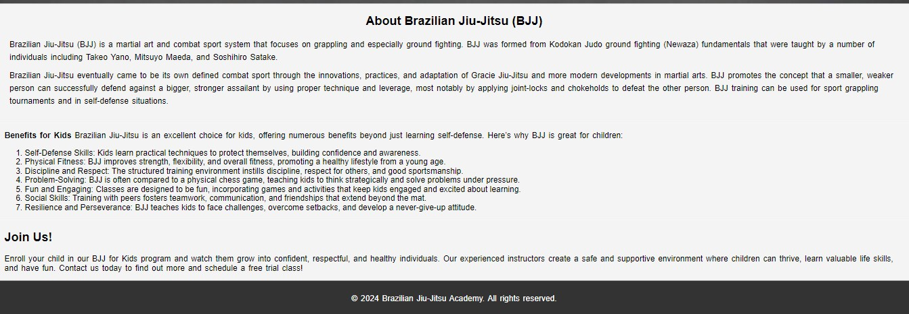

BJJ Club for Kids
Welcome to the BJJ Club for Kids! Our gym specializes in martial arts and self-defense training specifically tailored for children. At BJJ Club, we focus on teaching honor, good values, and practical skills to help your child stay safe and confident in any situation.

https://ui.dev/amiresponsive?url=https://jarlon13.github.io/bjjkids/index.html

<h2>Features</h2>
    <ul>
<li>Navigatioon
        <ul>
        <li> Featured at the top left side of the page, the navigation shows 2 menus. </li>
        <li> Home menu which is the main page.</li>
        <li> Sign up menu that brings you to the Sign up page to be part of the BJJ Club for kids.</li>
        <li> The navigation clearly tells the user name home menu and sign up menu making it really easy to navigate in the both pages.  </li>
        </ul>
    </li>
</ul>

  

<li> The Header / The welcome message
        <ul>
        <li>The header shows Welcome to the BJJ Club for KIDS with 2 font awesome icon jumping of excitment !  </li> 
        <li> Below the Welcome to Brazilian Jiu-Jitsu there are 3 pictures of kids practing the martial arts and having fun  ! </li>
        </ul>
    </li>
</ul>

  

<li>About Brazilian Jiu-Jitsu (BJJ)
        <ul>
        <li> About us explain to the readers about the BJJ and the benefits this could bring to the kids </li>
        <li> This section shows the importance of the self defense martial arts for the little ones  </li>
        </ul>
    </li>
</ul>

 <li>The Signup Form
        <ul>
        <li> The sign up section has a form to collect details from parents so they can sign up to the Coding Club</li>
        <li>The form collects child's name , parent's name , full name and email address. </li>
        <li> The sign up form is  a valuable to the user as it fives them the ability to sign up to join the BJJ Club for kids </li>
        </ul>
    </li>
</ul>

<li> The Location section
        <ul> 
    <li>In the sign up page you can find a link to the google maps showing where the BJJ Club for kids is located 
    </li>
    <!--<li>TEST 2</li> -->
        </ul>
    </li>
</ul>

<li> Testing
        <ul> 
            <li>I have tested and this page works in different browser: Chrome , Safari , Edge </li>
            <li>I confirm that this project is responsive, looks good and function on all standard screen sizes , using the devtools device toolbar.
            </li>        
        </ul>
     </li>
<li> Bugs
    <ul> 
        <li> When I deployed my project to the Git hub pages , I have found that my website was only working with the html codes, my css wasn't connecting to the correct file </li>
        <li> I found that when I deployed the project I had used absolute file paths in my code. </li>
         
    </ul>
</li>

<ul>
   <li> Removing the starting / fixed the problem.</li>
</ul>

About Us
The BJJ Club for Kids is dedicated to fostering a supportive and empowering environment where children can thrive. Our experienced instructors are passionate about teaching Brazilian Jiu-Jitsu (BJJ) and instilling lifelong values in our young students. We believe that martial arts are not just about physical training but also about mental and emotional growth.

Our Philosophy
We emphasize the importance of:

Respect: Teaching kids to respect themselves and others.
Discipline: Encouraging self-control and focus both on and off the mat.
Perseverance: Helping children develop a never-give-up attitude.
Teamwork: Promoting collaboration and building strong friendships.
Benefits of Brazilian Jiu-Jitsu for Kids
Self-Defense Skills: Our program equips children with practical techniques to protect themselves, boosting their confidence and safety.
Physical Fitness: BJJ enhances strength, flexibility, and overall health, promoting a lifelong commitment to fitness.
Mental Growth: Kids learn problem-solving skills and strategic thinking through the practice of BJJ.
Emotional Development: Our supportive environment helps children build resilience, handle stress, and develop a positive mindset.
Fun and Engaging: Our classes are designed to be enjoyable, incorporating games and activities to keep kids motivated and excited about learning.
Join Us!
Enroll your child in our BJJ for Kids program and watch them grow into confident, respectful, and healthy individuals. We offer a safe and encouraging atmosphere where children can develop valuable life skills while having fun. Contact us today to learn more and schedule a free trial class!

For more information, visit our website.

